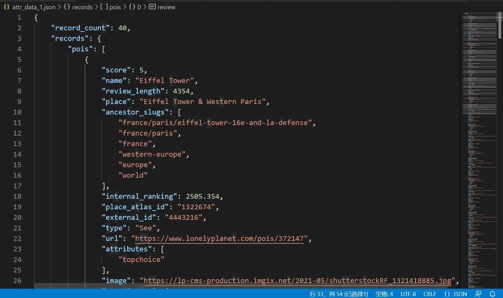
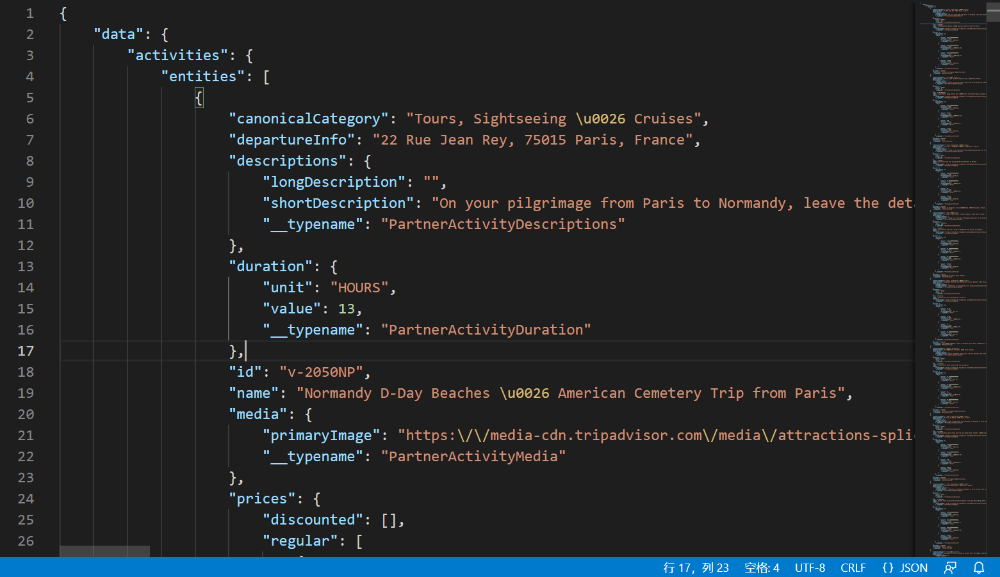
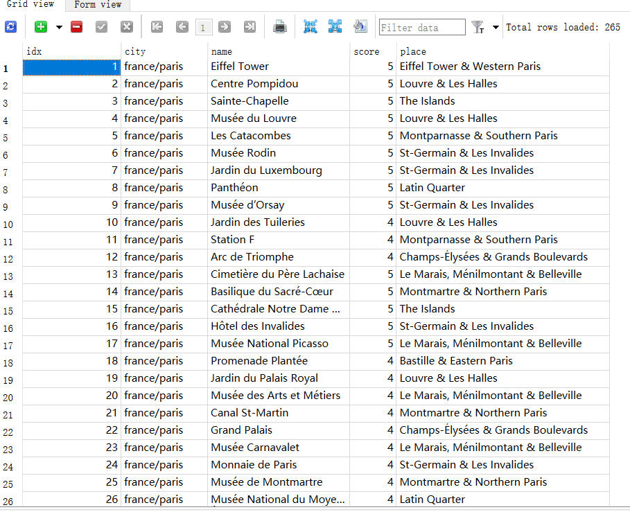

## 2022/1/24

- 完成了` https://www.lonelyplanet.com`网站中关于景点（Attraction）和旅行体验（Experiences）的HTTP请求的分析
- 实现了对这两个信息的爬取





- 使用SQLte3存储其中的主要信息



### 还需要解决的问题

- 不知道如何处理旅行体验（experiences）的数据，不知道如何从描述中得到有效的信息

     ```json
      {
        "descriptions": {
                longDescription : "Join us for the perfect Parisian day! Embark on a delicious adventure with this three-hour private Paris tour that stops off at iconic wine bars, bistrots and brasseries. Time to get your foodie game face on with some iconic French food, wine and craft beers!\u00a0\r\nThe best things to do in Paris often revolve around food and wine. On this Paris tour, you will try some of the city\u2019s famous specialties, from snails, to cheese or charcuterie, always paired with wine or beer. Your call what goes best together with the food!\u00a0\r\nYou\u2019ll start this tour on Place de la Bastille,\u00a0the place where the former Bastille prison once stood and where the French Revolution started. Learn about that significant part of French history that still defines us. From here we\u2019ll move to our first stop, a historic bistrot that looks identical to how it did a century ago. It\u2019s here that we\u2019ll try our first bite, some iconic French snails with a glass of wine.\u00a0\r\nWe\u2019ll continue\u00a0your\u00a0tour in the Faubourg Saint-Antoine, formerly a working class neighbourhood, known for its furniture artisans, blue collar feel and\u2026 revolutionary\u00a0vibe!\u00a0\r\nFrom there, we\u2019ll reach one of\u00a0Paris\u2019 most quintessential wine bars. At this friendly wine paradise, the bar serves locals and visitors with the same passion. You might still find old barrels where neighbours can just come and fill their empty bottles for a few euros. Here, you\u2019ll learn about the long history of wine in France, while tasting some wine of course! We\u2019ll also pair that wine\u00a0with some of France\u2019s best charcuterie: delicious p\u00e2t\u00e9s, rillettes\u00a0and\u00a0smoked hams.\u00a0\r\nFrom here we\u2019ll move to one of\u00a0Paris\u2019 oldest markets: March\u00e9 d\u2019Aligre. Take a moment to wander on your own on this iconic bustling market full of delicious French products. We\u2019ll meet\u00a0at the cheese seller stall to grab our beautiful platter of French cheese. After a brief explanation about the different cheeses, we\u2019ll head to a famous beer bar that serves over 300 different beers. You\u2019ll get to try three different tasters from three very different kinds of beers produced in France, which we\u2019ll pair with the cheese. Trust us, while wine and cheese gets all the credit, beer and cheese pairings are becoming more common. This is your chance to discover how well French cheese and Parisian craft beers go together!\u00a0\r\nIf you\u2019re still in the mood, we\u2019ll walk back to Bastille using a beautiful but completely unknown elevated former railway line that\u2019s been turned into a park. The route offers great views over the neighbourhood. The tour will end back at Bastille Square, unless you prefer to keep partying in the buzzing Aligre area!\r\n(If you\u2019d prefer to travel as part of a regular group experience, please book our\u00a0Paris\u00a0Beer vs Wine group tour.)\r\nThis tour is priced for a minimum group size of two travellers. A solo traveller may still book this private experience but will be charged the base rate for two travellers.",
                shortDescription : "Wine + French food + craft beer = a fantastic way to discover\u00a0Paris! Join this laid-back,\u00a0private food and drink-focused walking tour to discover\u00a0Paris\u00a0through its bistrots, wine bars, brasseries, and cool local neighbourhoods. Soak up French culture, learn more about the city, and get your fill of wine, craft beer, and local treats along the way.\r\n\u00a0\r\nThis tour is priced for a minimum group size of two travellers. A solo traveller may still book this private experience but will be charged the base rate for two travellers.\r\n\r\n\r\n\r\n\r\nExperience the best travel stories for yourself. Join a local expert and uncover hidden gems on this city adventure hand-picked by the world\u0027s leading travel publisher. Lonely Planet Experiences powered by Urban Adventures bring stories to life in the best-loved cities around the globe.\r\n\r\n"
                          },
        name: "Lonely Planet Experiences Private Paris Tour: Beer vs Wine"
      }
     ```

  	例如这一条信息中，在`name`下可以看到beer和wine，但是在`longDescription`中还提到了和酒搭配的芝士、蜗牛等美食：

> On this Paris tour, you will try some of the city's famous specialties, from snails, to cheese or charcuterie, always paired with wine or beer. Your call what goes best together with the food!

​	不知道该如何提取这类信息

- 由于目标是做一个可以查询的网页，因此继续使用SQLite并不合适，之后会替换为SQL Server

- 完善程序结构